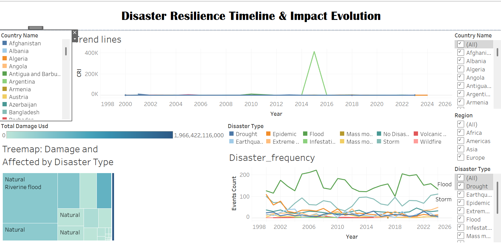
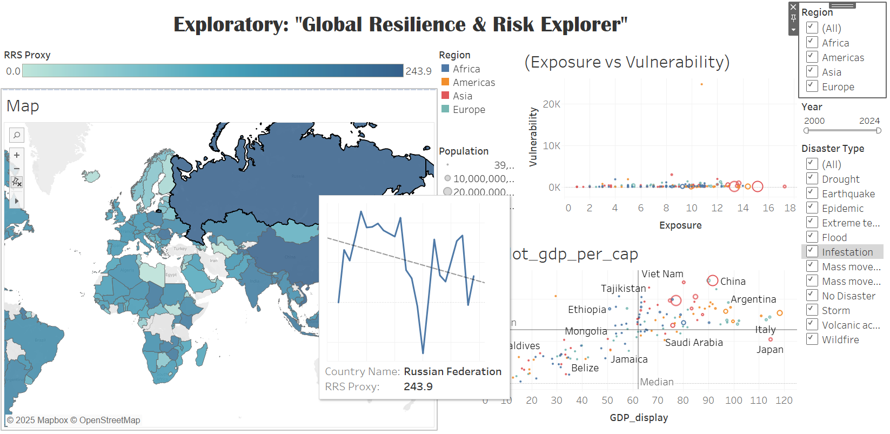

# Global Disaster Resilience Analysis & Dashboard

## Overview
This project analyzes global disaster data to measure how countries respond to and recover from disasters using data-driven techniques.

By integrating datasets from EM-DAT, World Bank, and UNDP, I developed key resilience metrics and built interactive dashboards to uncover patterns in disaster impact and recovery.

---

## Problem
Disaster resilience is complex and cannot be measured directly. Organizations struggle to:
- Combine multiple data sources
- Understand disaster impact across countries
- Identify high-risk regions

---

## Solution
I built a complete data analysis pipeline to transform raw disaster data into actionable insights:

- Integrated multi-source datasets (6600+ records)
- Cleaned and normalized data using Python (Pandas)
- Developed custom resilience metrics:
  - Disaster Impact Index (DII)
  - Composite Resilience Index (CRI)
- Created interactive Tableau dashboards for visualization

---

##  Key Insights
- Strong correlation between GDP and resilience (wealthier countries recover faster)
- Identified "Critical Risk Zones" with high exposure and low adaptive capacity
- Found differences between economic loss vs human impact across regions

---

##  Tools & Technologies
- Python (Pandas, NumPy)
- SQL
- Tableau
- Data Cleaning & ETL
- Data Visualization

---

##  Dashboard Preview

---

##  Dataset
- EM-DAT (Disaster Data)
- World Bank (Economic Indicators)
- UNDP (Human Development Index)

---

##  What This Project Demonstrates
- Real-world data cleaning and preprocessing
- Building ETL pipelines
- Data-driven decision making
- Dashboard development for business insights

---

## Contact
If you need help with data analysis, dashboards, or cleaning messy datasets, feel free to reach out!
